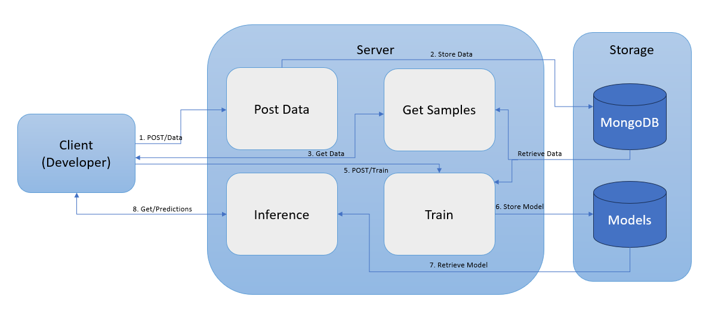

# MLE Take-Home Assignment Starter


**Ovreview**: Create a basic ML Prediction service that ingests data into a MongoDB, trains a model, and serves predictions via an API. The system will use Docker and MongoDB and be ready for CI/CD integration.

**Usecase**: A Predictive ML microservice around the classic Iris dataset. In real-world terms - A client (eg: web app, another service) needs to classify new measurements of iris flowers into one of three species (setosa, versicolor, virginica).

## Core High-level Functional Requirements

**Data Ingestion**: Accept JSON samples (features + label) via POST /data and persist them.

**Data Retrieval**: List existing samples (optionally filtered by label) via GET /data.

**Model Training**: On demand (POST /train), pull all stored samples, fit an ML model, and serialize it.

**Prediction**: Accept feature-only payload via POST /predict, load the latest model, and return a label and confidence.

## **End-to-End Data Flow of the implementatation**



## Project Structure

```
.
├── app/
│   ├── configuration.py            # Env configs
│   ├── main.py                     # FastAPI app
│   ├── model.py                    # ML logic
│   ├── mongodb.py                  # MongoDB operations
│   ├── schema.py                   # Pydantic models
│   ├── utils.py                    # Utility functions
│
├── data/
│   └── iris.csv                    # Iris dataset
│
├── notebooks/
│   ├── Iris_test.ipynb             # Notebook test IRIS model before integrating it to the MLOps pipeline
│   ├── Iris_train.ipynb            # Notebook to experiment and train IRIS Data
│   ├── IrisData_Exploration.ipynb  # Iris data analysis and vizualisation
│
├── models/
│   ├── model.pkl                   # Trained model from API
│   ├── test_model.pkl              # Trained model from notebook
│
├── tests/
│   ├── test_main.py                # API tests
│   ├── test_mongodb.py             # DB tests
│
├── Dockerfile
├── docker-compose.yml
├── .gitlab-ci.yml
├── pyproject.toml
├── poetry.lock
├── README.md
└── CHANGELOG.md
```


## Setup and Run Locally

1. Install poetry (python dependency and management tool)
`pip install poetry
`

2. Install project dependencies:
`poetry install
`

3. Run MongoDB (Local):
`docker run -d --name local-mongo -p 27017:27017 mongo
`

4. Run FastAPI app:
`poetry run uvicorn app.main:app --reload
`

## Run with Docker Compose
`docker compose up --build
`
- Service runs on http://localhost:8000
- MongoDB database at mongodb://localhost:27017


## Endpoints and Curl Commands

1. Upload Data: Load full Iris CSV into MongoDB

`curl -X POST "http://localhost:8000/data/iris" -H "accept: application/json"
`

2. View Uploaded Data: List data from db

`curl -X GET "http://localhost:8000/data/iris" -H "accept: application/json"
`

3. Train Model: Train ML model on DB data

`curl -X POST "http://localhost:8000/train/iris" -H "accept: application/json"
`

4. Make Prediction: Predict species based on features

`
curl -X POST "http://localhost:8000/predict/iris" \
-H "accept: application/json" \
-H "Content-Type: application/json" \
-d '{"sepal_length":5.1, "sepal_width":3.5, "petal_length":1.4, "petal_width":0.2}'
`

## GitLab CI/CD Pipeline
Stages:

lint ➔ check code quality

build ➔ build Docker image

test ➔ run unit tests

The pipeline triggers on `git push`

## Testing

To run tests locally,
`poetry run pytest --disable-warnings`

## Submitted by:
```
Name: Anish K Navalgund
Email: anishk.navalgund@gmail.com
```
